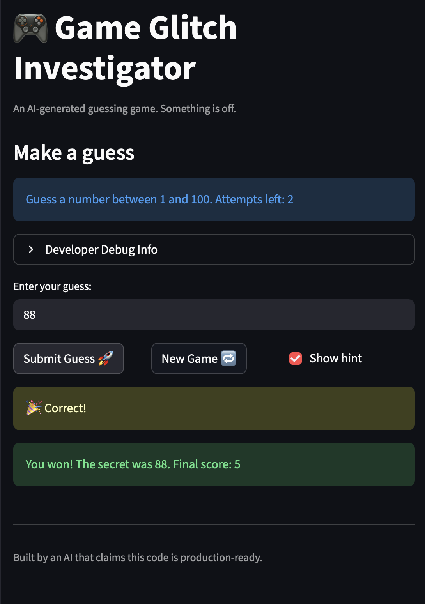

# 🎮 Game Glitch Investigator: The Impossible Guesser

## 🚨 The Situation

You asked an AI to build a simple "Number Guessing Game" using Streamlit.
It wrote the code, ran away, and now the game is unplayable. 

- You can't win.
- The hints lie to you.
- The secret number seems to have commitment issues.

## 🛠️ Setup

1. Install dependencies: `pip install -r requirements.txt`
2. Run the broken app: `python -m streamlit run app.py`

## 🕵️‍♂️ Your Mission

1. **Play the game.** Open the "Developer Debug Info" tab in the app to see the secret number. Try to win.
2. **Find the State Bug.** Why does the secret number change every time you click "Submit"? Ask ChatGPT: *"How do I keep a variable from resetting in Streamlit when I click a button?"*
3. **Fix the Logic.** The hints ("Higher/Lower") are wrong. Fix them.
4. **Refactor & Test.** - Move the logic into `logic_utils.py`.
   - Run `pytest` in your terminal.
   - Keep fixing until all tests pass!

## 📝 Document Your Experience

- [ ] Describe the game's purpose. 
- This project is a number guessing game built with Streamlit where the player tries to guess a secret number between 1 and 100 within a limited number of attempts.
- [ ] Detail which bugs you found.
- At the beginning, the game had several bugs. The secret number changed on every interaction because the state was not stored correctly, making it impossible to win. In addition, the hint system was broken and sometimes gave incorrect or impossible feedback, such as telling the player to guess lower even when the minimum value was entered.
- [ ] Explain what fixes you applied.
- To fix these issues, I stored the secret number in Streamlit session state so it would persist across reruns. I also corrected the comparison logic so guesses are evaluated numerically rather than as strings. Finally, I refactored the core game logic into `logic_utils.py` and verified the fix by running pytest and manually testing the game.

## 📸 Demo

- [ ] [Insert a screenshot of your fixed, winning game here]

## 🚀 Stretch Features

- [ ] [If you choose to complete Challenge 4, insert a screenshot of your Enhanced Game UI here]
